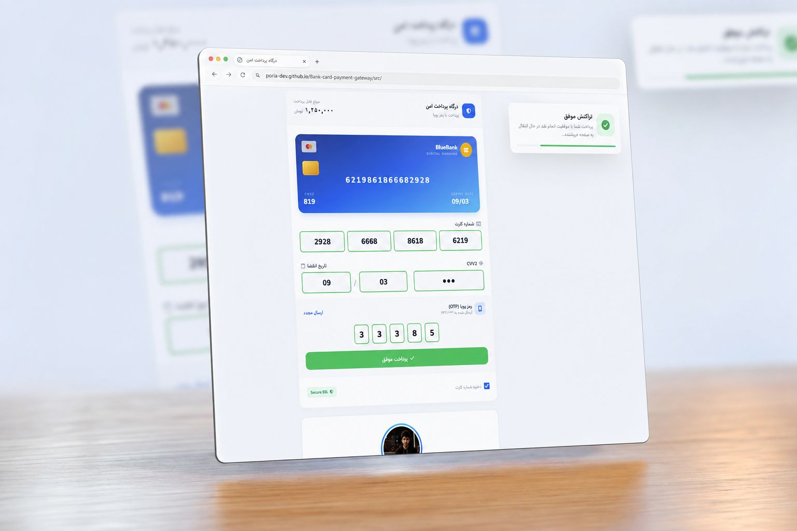

# 💳 Bank Card Payment Gateway UI

<h3 align="center">
Modern & Responsive Payment Gateway Interface
</h3>

A premium payment gateway UI built with Vanilla JavaScript and Tailwind CSS.
Designed with a focus on clean UI, user experience and responsive design.

## 🚀 Live Demo

🔗 **Demo:**  
https://poria-dev.github.io/Bank-card-payment-gateway/src

---

## 📸 Preview

---

# ✨ Features

✅ Modern banking payment interface

✅ Responsive design for mobile, tablet and desktop

✅ Dynamic card number preview

✅ CVV2 and expiration date preview

✅ OTP verification UI

✅ Toast notification system

✅ Smooth animations

✅ Secure payment style design

✅ Custom payment card component

✅ Clean and minimal user experience

---

# 🛠 Technologies

## Front-End

- HTML5
- Tailwind CSS
- JavaScript (Vanilla JS)
- Font Awesome Icons

---

# 🎨 UI Design

The interface is inspired by modern digital banking platforms.

Main design principles:

- Minimal & clean layout
- Glassmorphism effects
- Soft shadows
- Modern color system
- User friendly form experience

---

# 📂 Project Structure

