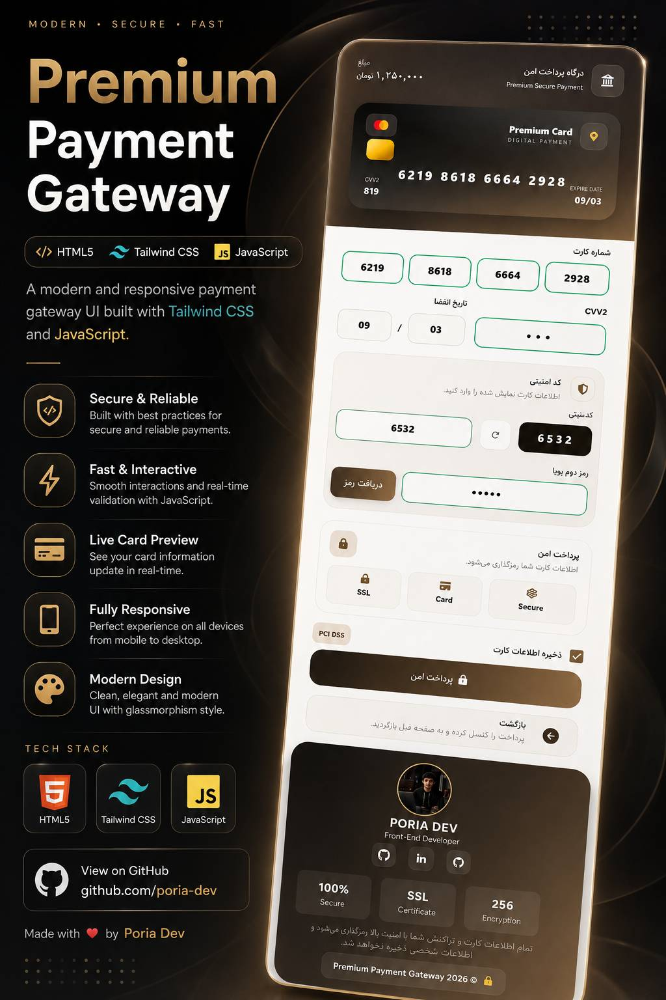

# 💳 Premium Payment Gateway UI

<p align="center">


</p>

<h1 align="center">
💳 Premium Banking Payment Gateway
</h1>

<p align="center">
A modern, responsive and interactive Banking Payment Gateway built using
<b>Vanilla JavaScript</b> and <b>Tailwind CSS</b>.
</p>

<p align="center">

Modern UI • Live Card Preview • Responsive • Secure • Interactive

</p>

---

## 📸 Preview

<p align="center">

</p>

---

# 🚀 Live Demo

### 🔗 Try it Here

https://poria-dev.github.io/Bank_Card/src

---

# ✨ Features

### 💳 Card System

- Live Card Number Preview
- Automatic Card Formatting
- Card Brand Ready
- Dynamic Card Information
- Expiration Date Preview
- CVV2 Live Preview

---

### 🔐 Payment Security

- OTP Verification UI
- Secure Payment Layout
- Professional Banking Design
- Modern Payment Experience
- Clean User Flow

---

### 🎨 User Interface

- Premium Banking UI
- Glassmorphism Style
- Soft Shadows
- Smooth Animations
- Beautiful Gradient Colors
- Minimal Design
- Responsive Layout

---

### 📱 Responsive

✅ Mobile

✅ Tablet

✅ Laptop

✅ Desktop

---

# ⚡ Interactive Components

- Dynamic Inputs
- Live Card Preview
- Toast Notification
- Auto Formatting
- Real-Time Validation
- Interactive Buttons
- Hover Effects
- Smooth Transitions

---

# 🛠 Tech Stack

| Technology | Description |
|------------|-------------|
| HTML5 | Page Structure |
| Tailwind CSS | Responsive UI |
| JavaScript | Interactive Logic |
| Font Awesome | Icons |

---

# 📂 Folder Structure

```text
Bank-card-payment-gateway
│
├── src
│   ├── assets
│   │   ├── images
│   │   ├── icons
│   │   └── fonts
│   │
│   ├── css
│   │
│   ├── js
│   │
│   ├── index.html
│   │
│   └── ...
│
├── README.md
└── LICENSE
```

---

# 🎯 Highlights

✔ Premium Banking Design

✔ Live Payment Experience

✔ Fully Responsive

✔ Built with Vanilla JavaScript

✔ Tailwind CSS UI

✔ Clean Code Structure

✔ Easy to Customize

✔ Modern User Experience

---

# 🌟 Future Improvements

- Dark Mode
- Multiple Card Themes
- Card Flip Animation
- Fake Payment API
- Persian & English Languages
- Accessibility Improvements

---

# 👨‍💻 Author

### Poria Dev

Frontend Developer

GitHub

https://github.com/poria-dev

---

<p align="center">

⭐ If you like this project, don't forget to give it a Star ⭐

</p>


